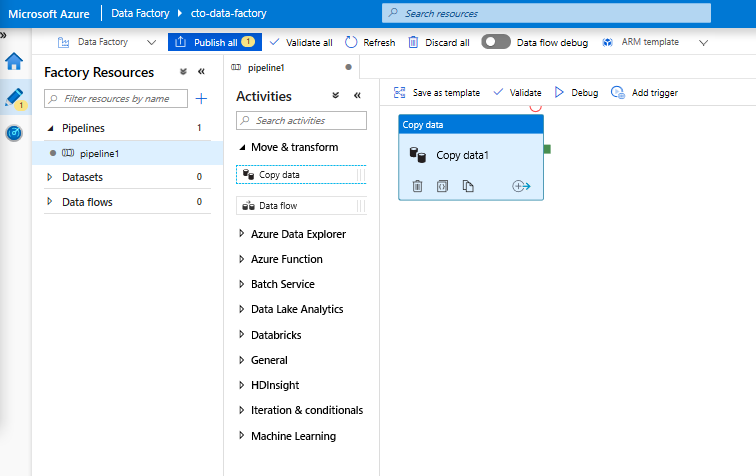
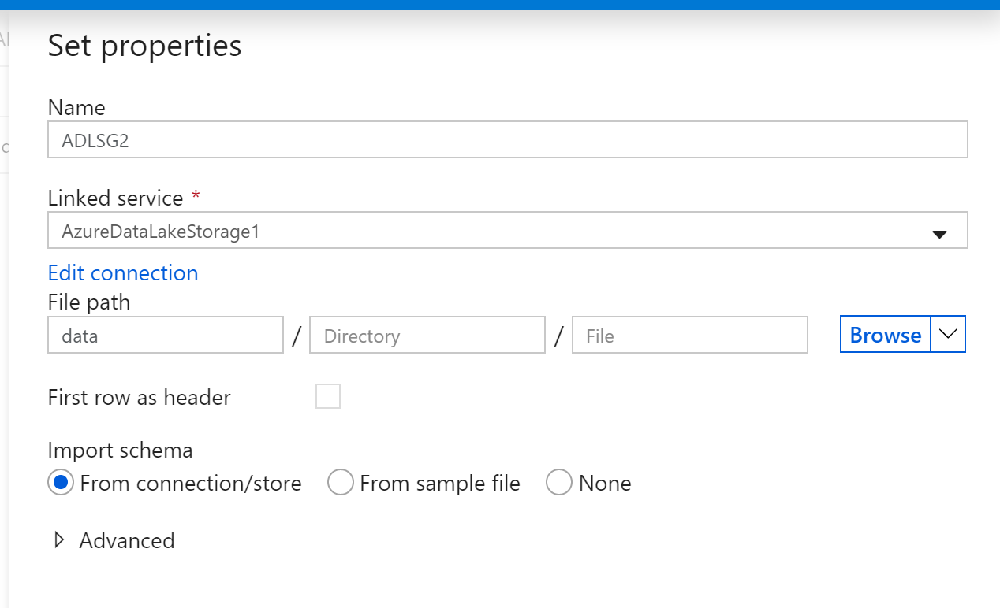
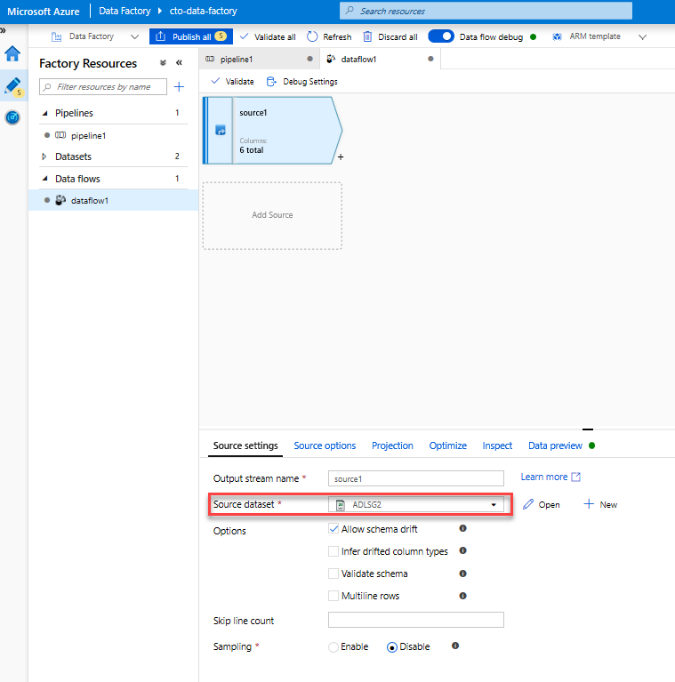
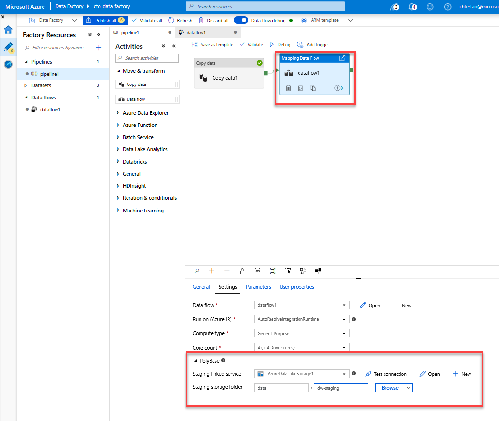

# Azure Data Services Lab

## Prerequisites

- Microsoft Azure subscription

# Lab Setup

## Automated Deployment


## Step 1: Automated Deployment

Press the "*Deploy to Azure*" button below, to provision the Azure Services required required for this lab.

<a href="https://portal.azure.com/#create/Microsoft.Template/uri/https%3A%2F%2Fraw.githubusercontent.com%2Fmicrosoft%2FAzureTrailblazerAcademy%2Fmaster%2Fmonth2%2Flabs%2Flab_data%2Fscripts%2Flab2_data_deployment.json" target="_blank"></a>

## Step 2: Deploy Azure Data Factory

While those other resources are being deployed, follow these steps to manually deploy Azure Data Factory.

1. In the Azure Portal, search for **Data Factories**
2. Click on the **Add** button
3. Fill out the form:
- **Name:** Choose a unique name for your Data Factory
- **Version:** V2
- **Subscription:** Choose your subscription
- **Resource Group:** Use the same Resource Group you used for the automated deployment in Step 1.
- **Location:** East US
- Uncheck the **Enable GIT** checkbox
4. Click the **Create** button


## Step 3: Validation of services

## Validate Correct provisioning of services

Estimated Time: 15 minutes
 
1. Once the automated deployment is complete, expand the resource group you used previosly and review that the following services are provisioned:

- Azure Synapse Analytics (SQL Data Warehouse)
- Azure Storage Accounts
- Azure Data Factory

2. Capture the name of your storage acccount (Data Lake Storage)
3. CLick on the SQL Data Warehouse
4. Click on **Firewalls and virtual networks** and select **Add Client IP**. Then click on **Save**.


5. Click on **Query Editor** and login using the user name and password you entered earlier.
6. Execute the following query:

```
CREATE MASTER KEY;
```

## Step 4: Populate the Azure Storage container Azure CloudShell

1. In the Azure Portal, open an Azure Cloudshell window.
   Complete the configuration process as needed

2. Type the following command to copy the deployment script to Azure Cloud Shell

   This will copy the deployment script that will populate the Azure Data Lake Storage Containers with sample files

```
curl -OL https://raw.githubusercontent.com/microsoft/AzureTrailblazerAcademy/master/month2/labs/lab_data/scripts/data_script.sh
```
1. Type the following to upload the sample files:

```
bash data_script.sh <storageaccountname>
```
Example: bash data_script.sh mdwdemostoredl

3. Click on the storage account and browse to **Containers**:

    - Validate that 2 containers **data** and **logs** are existing
    - Click on the **data** container and validate that these 2 files exist:
        - preferences.json
        - DimDate2.txt
    - Repeat the validation for the **logs** container as well, validate that these 3 files exist in the container:
        - preferences.json
        - weblogsQ1.log
        - weblogsQ2.log
## Step 5: Ingest data using the Copy Activity
  
Estimated Time: 15 minutes

### Task 1: Add the Copy Activity to the designer

1. Navigate to the resource group and open the Azure Data Factory resource.

1. In the Azure Data Factory screen, in the middle of the screen, click on the button, **Author & Monitor**

1. **Open the authoring canvas** If coming from the ADF homepage, click on the **pencil icon** on the left sidebar or the **create pipeline button** to open the authoring canvas.

1. **Create the pipeline** Click on the **+** button in the Factory Resources pane and select **Pipeline**.

1. Search for **Copy data** In the Activities pane and drag the accordion onto the pipeline canvas.

    


### Task 2: Create a new HTTP dataset to use as a source

1. Click on the **Copy data** activity and, in the Source tab of the activity settings, click **+ New**

2. In the data store list, select the **HTTP** tile and click continue

3. In the file format list, select the **DelimitedText** format tile and click continue

4. In Set Properties blade, give your dataset an understandable name such as **HTTPSource**. Click on the **Linked Service** dropdown and select **New**.

5. In the New Linked Service (HTTP) screen, specify the url of the moviesDB csv file. You can access the data with no authentication required using the following endpoint:

    https://raw.githubusercontent.com/microsoft/AzureTrailblazerAcademy/master/month2/labs/lab_data/data/moviesDB.csv

6. Place this in the **Base URL** text box. 

7. In the **Authentication type** drop down, select **Anonymous**. and click on **Create**.


8. Once you have created and selected the linked service, specify the rest of your dataset settings. These settings specify how and where in your connection we want to pull the data. As the url is pointed at the file already, no **Relative URL** is required. As the data has a header in the first row, set **First row as header** to be true and select Import schema **From connection/store** to pull the schema from the file itself. In the **Request method** dropdown, select **Get**. 

    You should see the following screen:

    
           
9. Click **OK** once completed.
   
10. To verify your dataset is configured correctly, click **Preview Data** in the Source tab of the copy activity to get a small snapshot of your data.
   
   

### Task 3: Create a new ADLS Gen2 dataset sink

1. Click on the **Sink tab**, and the click **+ New**

2. Select the **Azure Data Lake Storage Gen2** tile and click **Continue**.

3. Select the **DelimitedText** format tile and click **Continue**.

4. In Set Properties blade, give your dataset an understandable name such as **ADLSG2**. Click on the **Linked Service** dropdown and select **New**.

5. In the New linked service (Azure Data Lake Storage Gen2) blade, select your authentication method as **Account key**, select your **Azure Subscription** and select your Storage account name of **awdlsstudxx**. You will see a screen as follows:

   

6. Click on **Create**

7. Once you have configured your linked service, you enter the set properties blade. As you are writing to this dataset, you want to point the folder where you want moviesDB.csv copied to. In the example below, you are writing to the  **data** folder. While the folder can be dynamically created, the file system must exist prior to writing to it.
    * Set **File path** to the 'data' folder in ADLS
    * Set **First row as header** to be true. 
    * Set **Import schema** to **From connection/store**




8. Click **OK** once completed.

### Task 4: Test the Copy Activity

At this point, you have fully configured your copy activity. To test it out, click on the **Debug** button at the top of the pipeline canvas. This will start a pipeline debug run.

1. To monitor the progress of a pipeline debug run, click on the **Output** tab of the pipeline

2. To view a more detailed description of the activity output, click on the eyeglasses icon. This will open up the copy monitoring screen which provides useful metrics such as Data read/written, throughput and in-depth duration statistics.

   

3. To verify the copy worked as expected, open up your ADLS gen2 storage account and check to see your file was written as expected

4. Click **Publish All** to deploy the pipeline to the factory

## Step 6: Preparing Data Factory Environment

### Task 1: Create Data Flow and add Data Source

1. **Turn on Data Flow Debug** Turn the **Data Flow Debug** slider located at the top of the authoring module on. 

    > NOTE: Data Flow clusters take 5-7 minutes to warm up.

2. Search for **Data Flow** In the Activities pane and drag the accordion onto the pipeline canvas. In the blade that pops up, click **Create new Data Flow** and select **Mapping Data Flow** and then click **OK**.

3. Click on the  **pipeline1** tab and drag the green box from your Copy activity to the Data Flow Activity to create an on success condition. You will see the following in the canvas:

    

4. Double click on the Mapping Data Flow object in the canvas and click on the **Add Source** button in the Data Flow canvas. In the **Source settings** tab click on the **Source dataset** dropdown and select the **ADLSG2** dataset that you used in your Copy activity.

    

5. Click on the **Projection** tab
6. Click on **Import Schema** and wait for source schema to be displayed
7. Once your debug cluster is warmed up, verify your data is loaded correctly via the Data Preview tab. Once you click the refresh button, Mapping Data Flow will show calculate a snapshot of what your data looks like when it is at each transformation.
  
### Task 2: Using Mapping Data Flow transformation

1. In the preview of the data, you may have noticed that the "Rotton Tomatoes" column is misspelled. To correctly name it and drop the unused Rating column, you can add a [Select transformation](https://docs.microsoft.com/azure/data-factory/data-flow-select) by clicking on the + icon next to your ADLS source node and choosing **Select** under the **Schema modifier** section.
    
    

2. In the **Name as** field, change 'Rotton' to 'Rotten'. Drop the Rating column by hovering over it and clicking on the trash can icon.

    

3. Since we are only interested in movies made after 1951, we'll add a [Filter transformation](https://docs.microsoft.com/azure/data-factory/data-flow-filter) to specify a filter condition. Click on the **+ icon** next to your Select transformation and choose **Filter** under the **Row Modifier** section.

4. Click on the **expression box** to open up the [Expression builder](https://docs.microsoft.com/azure/data-factory/concepts-data-flow-expression-builder) and enter in your filter condition. Using the syntax of the [Mapping Data Flow expression language](https://docs.microsoft.com/azure/data-factory/data-flow-expression-functions), enter the following:

    ```
    toInteger(year) > 1950
    ```


    

5. You can click the **Refresh** button to verify your condition is working properly in the embedded Data preview pane. Click **Save and finish**.

6. As you may have noticed, the genres column is a string delimited by a '|' character. We only care about the *first* genre in each column so we are going to derive a new column called **PrimaryGenre** using the [Derived Column](https://docs.microsoft.com/azure/data-factory/data-flow-derived-column) transformation. Click on the **+ icon** next to your Filter transformation and choose **Derived** under the **Schema Modifier** section. Similar to the filter transformation, the derived column uses the Mapping Data Flow expression builder to specify the values of the new column.

    

7. Create a new column called PrimaryGenre and enter the following in the expression field:

    ```
    iif(locate('|',genres)>1,left(genres,locate('|',genres)-1),genres)
    ```

8. Click **Save and finish**.
   
9. We are interested in how a movie ranks within its year for its specific genre. For that, we will add a [Window transformation](https://docs.microsoft.com/azure/data-factory/data-flow-window) to define window-based aggregations. Click on the **+ icon** next to your Derived Column transformation and select **Window** under the **Schema modifier** section. We will window over PrimaryGenre and year with an unbounded range, sort by Rotten Tomato descending, a calculate a new column called RatingsRank which is equal to the rank each movie has within its specific genre-year. See below:

    

    

    

    

10. Now that you have gathered and derived all your required data, we will add an [Aggregate transformation](https://docs.microsoft.com/azure/data-factory/data-flow-aggregate) to calculate metrics based on a desired group. Click on the **+ icon** next to your Window transformation and select **Aggregate** under the **Schema modifier** section. As you did in the window transformation, lets group movies by PrimaryGenre and year

    

11. In the Aggregates tab, you can aggregations calculated over the specified group by columns. For every genre and year (selected in the "Group By" tab), lets get the average Rotten Tomatoes rating, the highest and lowest rated movie (utilizing the windowing function) and the number of movies that are in each group. Aggregation significantly reduces the amount of rows in your transformation stream and only propagates the group by and aggregate columns specified in the transformation.

    

    These are the 4 expressions shown in the previous screenshot. You can use those to copy and paste in the **Aggregates** section above:

    ```
    avg(toInteger({Rotten Tomato}))
    ```
    ```
    first(title)
    ```
    ```
    last(title)
    ```
    ```
    count()
    ```

12. Go to **Data Preview** tab and click on **Refresh** to see how the aggregate transformation changes your data.
   

13. Since we are writing to a tabular sink, we can specify insert, delete, update and upsert policies on rows using the [Alter Row transformation](https://docs.microsoft.com/azure/data-factory/data-flow-alter-row). Click on the **+ icon** next to your Aggregate transformation and click **Alter Row** under the **Row modifier** section. Since we are always inserting and updating, you can specify that all rows will always be upserted.

    

    

### Task 3: Writing to a Data Sink

Now that you have finished all your transformation logic, you are ready to write to a Sink.

1. Add a **Sink** by clicking on the **+ icon** next to your Upsert transformation and clicking **Sink** under the **Destination** section.

2. In the Sink tab, create a new data warehouse dataset via the **+ New** button.

3. Select **Azure Synapse Analytics** from the tile list and click **Continue**.

4. Open the *Linked service** dropdown and click on **+ New** to configure a Azure Synapse Analytics connection to connect to the Data Warehouse that we created earlier. Select the datawarehouse from the dropdown, select **SQL authentication** as the **Authentication type** and the **user name** and **password** you used when you created the Datawarehouse.
    

5. Click **Create**.

6. In the dataset configuration, select **Create new table** and enter in **Dbo** in the Schema field and **Ratings** in table name field. Click **OK** once completed.
    

7. Since an upsert condition was specified, you need to go to the Settings tab and select 'Allow upsert' based on key columns PrimaryGenre and year.
    

At this point, You have finished building your 8 transformation Mapping Data Flow. It's time to run the pipeline and see the results!


## Task 4: Running the Pipeline

1. Go to the pipeline1 tab in the canvas. Since Azure Synapse Analytics in Data Flow uses [PolyBase](https://docs.microsoft.com/sql/relational-databases/polybase/polybase-guide?view=sql-server-2017), you must specify a blob or ADLS staging folder. In the Data Flow activity's settings tab, open up the PolyBase section and select your ADLS linked service and specify **data** as the container and **dw-staging** as the staging directory.

    

2. Before you publish your pipeline, run another debug run to confirm it's working as expected. Looking at the Output tab, you can monitor the status of both activities as they are running.

3. Once both activities succeeded, you can click on the eyeglasses icon next to the Data Flow activity to get a more in depth look at the Data Flow run.

4. If you used the same logic described in this lab, your Data Flow should will written 737 rows to your SQL DW.

5. To verify that, go back to the Azure Portal and expand the data warehouse blade in your resource group. Click on **Query Editor (preview)** from the SQL data warehouse blade and write the following query:

```
select count(*) from dbo.Ratings
```

6. Finally, to see the data that was loaded in the Data Warehouse, enter the following query:

```
select * from dbo.Ratings
```